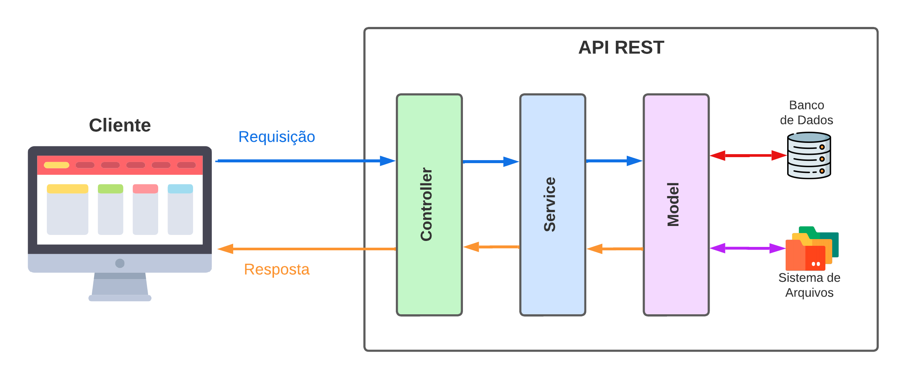

# Arquitetura MSC

Daqui pra frente vamos utilizar o modelo de _arquitetura de software_ chamado de _modelo baseado em camadas_. Este possui 3 camadas denomidas:
  - _Model_
    - Camada responsável pela comunicação com o Banco de Dados ou o Sistema de Arquivos.
  - _Sevice_
    - Camada responsavel por validar regrads de negócio.
  - _Controller_
    - Camada responsável pela por validar valores e requisições, entre outros.

