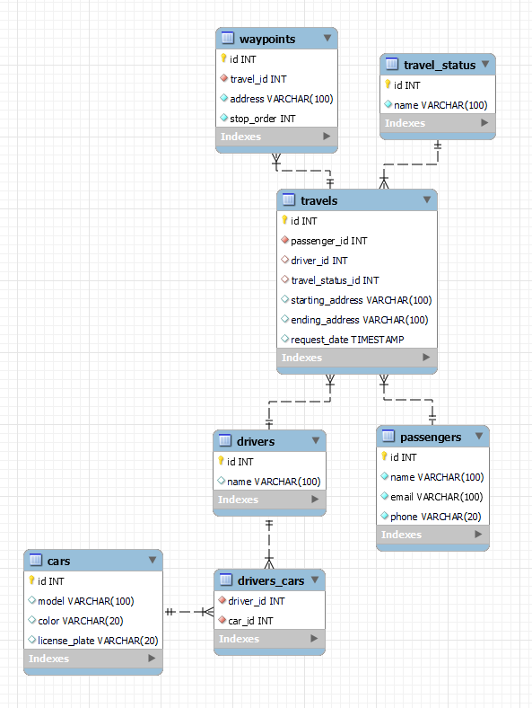

# Camada Model

A partir daqui iremos refatorar o código de acordo com a Arquitetura MSC de uma aplicação já construída. A API REST chamada [TrybeCar](https://github.com/tryber/msc-architecture-trybecar/tree/complex-application).

Como pessoa desenvolvedora, dificilmente vamos criar aplicações do zero. Então trabalhar dessa forma, servirá como um treino para melhorar as habilidades de refatorar código.

O projeto TrybeCar possui a seguinte estrutura de diretórios:
```
.
├── src/
│   ├── app.js
│   ├── connection.js
│   └── server.js
├── tests/
│   ├── integration/
│   │   └── -
│   └── -unit/
│       └── -
├── .env-example
├── docker-compose.yml
├── script.sql
├── thunder-trybecar.json
└── package.json
```

Com os endpoints definidos no arquivo __src/app.js__
-  __POST__ _/passengers/:passengerId/request/travel_
  - Inicia uma corrida a partir do ID do passageiro e tem o seguinte JSON no corpo da requisição:
```
{
  "startingAddress": "Rua AAAA",
  "endingAddress": "Rua BBBB",
  "waypoints": [
    {
      "address": "Ponto 01",
      "stopOrder": 1
    },
    {
      "address": "Ponto 02",
      "stopOrder": 2
    },
    {
      "address": "Ponto 03",
      "stopOrder": 3
    }
  ]
}
```
- __GET__ _/drivers/open/travels_
  - Lista das corridas em aberto, ou seja, sem nenhum motorista vinculado. Retorna um JSON semelhante ao seguinte:
```
[
  {
    "id": 1,
    "passengerId": 3,
    "driverId": null,
    "travelStatusId": 1,
    "startingAddress": "Rua AAAA",
    "endingAddress": "Rua BBBB",
    "requestDate": "2022-08-22T23:34:40.000Z"
  },
  {
    "id": 2,
    "passengerId": 3,
    "driverId": null,
    "travelStatusId": 1,
    "startingAddress": "Rua XYZ",
    "endingAddress": "Rua IJK",
    "requestDate": "2022-08-22T23:35:04.000Z"
  }
]
```
- __PUT__ _/drivers/:driverId/travels/:travelId/assign_
  - Endpoint em que a pessoa motorista se vincula a uma viagem em aberto utilizando o ID do motorista e o ID da viagem.
- __PUT__ _/drivers/:driverId/travels/:travelId/start_
  - Endpoint para a pessoa motorista iniciar uma viagem, sendo necessário passar como parÂmetro o ID do motorista e o ID da viagem
- __PUT__ _/drivers/:driverId/travels/:travelId/end_
  - Endpoint para finalização de uma viagem em andamento, usando como parâmetro o ID do motorista e o ID da viagem.

Nossa tarefa, nesse dia, é criar a camada Model e tem como responsabilidade amodar as entidades da aplicação.

As entidades são:
  - Pessoa Motorista
  - Pessoa Passageira
  - Viagem



⚠️ Na raiz do repositório do TrybeCar podemos encontrar um arquivo _script.sql_ para popular o banco de dados.

A partir daqui vamo começar a analisar e fetaorar o endpoint __POST__ _/passengers/:passengerId/request/travel_